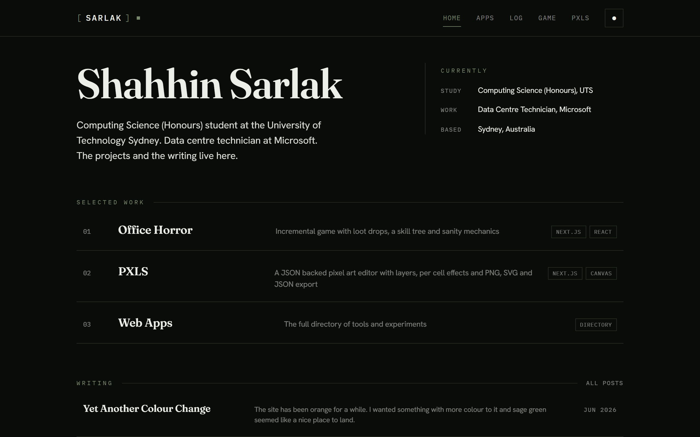
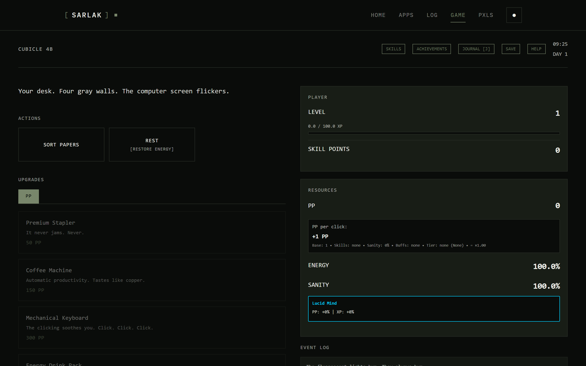
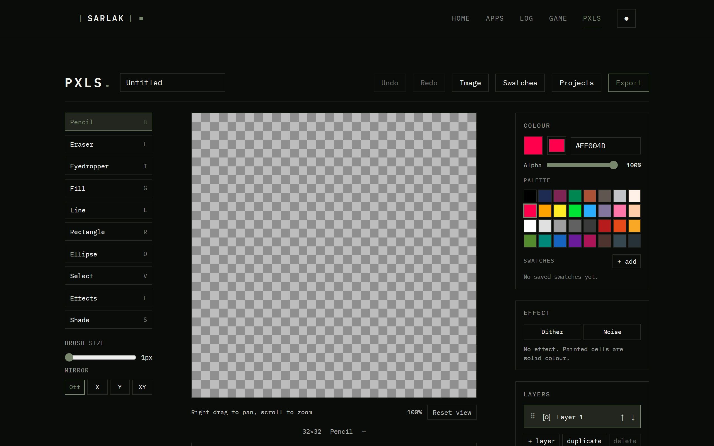
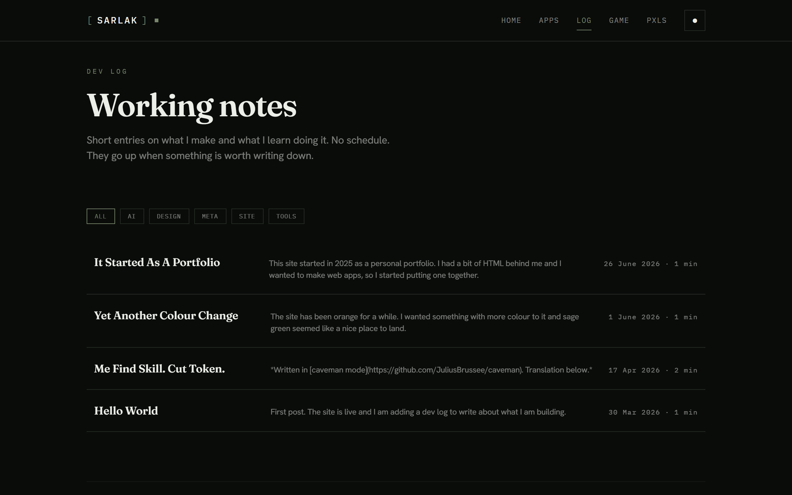

# SARLAK

This is my site. I am Shahhin Sarlak, a Computing Science (Honours) student at the
University of Technology Sydney and a data centre technician at Microsoft.

It started in 2025 as a personal portfolio. I had a bit of HTML behind me and I wanted to
make web apps, but only a couple of weeks in I found Claude, and this was back when you
still had to paste chunks of code into the chat and ask it to review them, before Claude
Code could reach into a directory on its own. That shifted what I wanted from the site, so
I stopped trying to showcase my coding and started learning as much as I could about
building with AI instead. What is here now is less a portfolio of what I can write by hand
and more a record of how I use AI to make different things.

It holds a few browser apps, a short form audio feed, an incremental horror game and a dev
log, all built as one Next.js site and running on AWS Amplify. Everything runs in the
browser, so you just open a page and it works with nothing to install.


*Home, June 2026.*

## What is inside

### Lure (`/lure`)

Lure is the newest thing here and it is a take on short form audio, basically a feed you
swipe through like TikTok but for things you listen to instead of watch. Every post opens
with an eight second preview that is built to hook you, and if it lands you just let it run
and it flows straight into the full piece, but if it does not grab you then you swipe up and
the next one starts. There are categories for all sorts of moods like horror and explainers
and book openings and poems and self help and calm, and for now the whole thing runs on
seeded audio with the sample voices generated locally, so there is no backend yet. It is a
prototype and the plan is to grow it into a real platform later, but the first slice was
getting that hook and swipe loop to feel right in the browser. The audio is regenerated with
`npm run generate:lure-audio`.

### Office Horror (`/game`)

An incremental office horror game I have been building for a while. You sort papers for
Productivity Points and manage Energy and Sanity while the office turns out to be a loop
you cannot leave. It has a flat skill tree, a printer and document system, a dimensional
portal and a Chapter 2 endgame with Insights, a Factory and Expeditions. Progress saves
to your browser. I keep the full system notes in `app/game/GAME_CONTEXT.md`.


*Office Horror, June 2026.*

### PXLS (`/pxls`)

A pixel art editor I wrote that runs entirely in the browser. It has layers, per cell
effects (dither, noise and shade) and frame based animation with GIF export. Projects are
JSON backed and export to PNG, SVG and JSON. I keep the full context in
`app/pxls/PXLS_CONTEXT.md`.


*PXLS, June 2026.*

### Dev log (`/log`)

Short notes on what I make and what I learn making it. No schedule. They go up when
something is worth writing down. Posts are markdown in `content/posts/`, rendered through
a gray-matter and remark pipeline (`lib/posts.js`).


*Dev log, June 2026.*

There are a few more routes too, a spin wheel and a survival prototype among them. The
full list is at `/apps`.

## Tech stack

- Next.js 15 (App Router) and React 19, plain JavaScript, no TypeScript.
- Self hosted fonts via `next/font/local`: Fraunces for display, Hanken Grotesk for body
  and IBM Plex Mono for UI and code.
- CSS Modules plus CSS variables for a dark and light theme (`data-theme`, remembered in
  localStorage).
- The game and PXLS keep their state in localStorage. No backend for them.
- A couple of API routes backed by the Anthropic API (`@anthropic-ai/sdk`).
- three.js for the particle experiment, gifenc for PXLS GIF export, gray-matter and
  remark for the dev log.
- Deployed on AWS Amplify (`amplify.yml`).

## Project structure

```
app/
  page.js            Home, the editorial landing
  layout.js          Root layout, fonts and theme bootstrap
  game/              Office Horror incremental game (see GAME_CONTEXT.md)
  pxls/              PXLS pixel art editor (see PXLS_CONTEXT.md)
  lure/              Lure short form audio feed prototype
  log/               Dev log, reads content/posts/
  apps/              Directory of apps and experiments
  wheel/             Spin wheel app and API route
  survival/          Survival prototype
  api/               Server routes (Anthropic backed)
components/          Header, Footer, ThemeToggle, BootSequence
content/posts/       Markdown source for the dev log
lib/posts.js         Markdown pipeline (gray-matter and remark)
docs/screenshots/    Screenshots used in this README
public/              Static assets
```

## Getting started

```bash
npm install
npm run dev      # dev server on http://localhost:3000
npm run build    # production build, the same one AWS Amplify runs
npm run lint     # ESLint
```

The build runs ESLint and fails on unescaped JSX entities, so I run `npm run build`
before I push.

## Notes

- I captured the screenshots in `docs/screenshots/` with Playwright against a production
  build. The date next to each one says when.
- My conventions and workflow live in `CLAUDE.md`. The deeper context for the two largest
  apps lives in `app/game/GAME_CONTEXT.md` and `app/pxls/PXLS_CONTEXT.md`.

## Connect

- Email: shahhinsarlak@gmail.com
- GitHub: https://github.com/shahhinsarlak
- LinkedIn: https://www.linkedin.com/in/shahhin-sarlak
